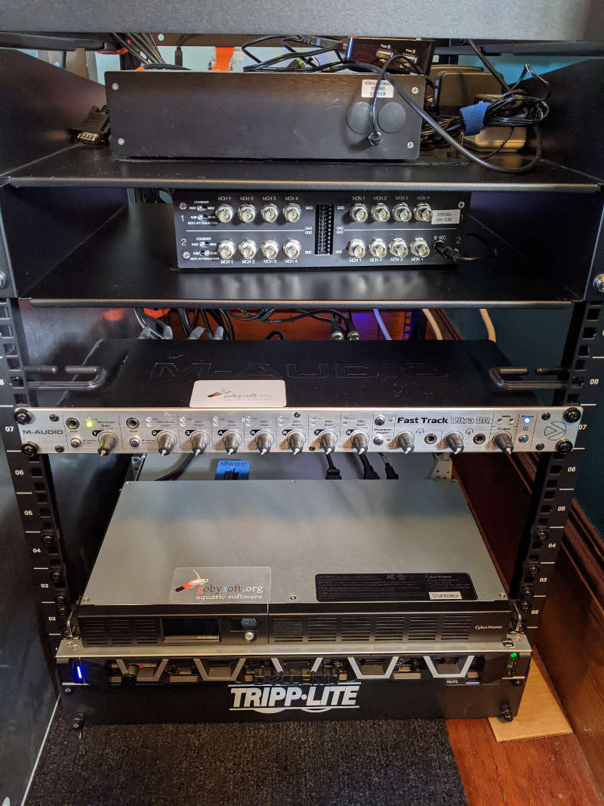

# NETSIM

*netsim* is a hybrid software/hardware system for realtime simulation of acoustic modem signals in a virtual ocean.

Relevant publications:

- NETSIM: A Realtime Virtual Ocean Hardware-in-the-loop Acoustic Modem Network Simulator, UComms 2018, Lerici Italy. [Paper](http://gobysoft.org/dl/schneider_schmidt_ucomms2018.pdf), [Presentation](http://gobysoft.org/dl/schneider_schmidt_ucomms2018_talk.pdf)

## Software

This section is a summary; for more detail, see the [Architecture](page10_architecture.md) page.

The software components of the core project are open source (LGPL/GPL) and reside in this repository:

- <https://github.com/GobySoft/netsim>

See [Building](page05_building.md) for how to install or build this software.

Additionally, a *processor* plugin is required to implement the simulated acoustic signal propagation. While a example processor (processor_echo) is implemented in the netsim repository, it doesn't do anything useful. For real work, we have implemented a plugin for the Laboratory for Autonomous Marine Sensing Systems' (LAMSS) Virtual Ocean Simulator. The Virtual Ocean resides in these software repositories:

- <https://github.mit.edu/lamss/lamss>
- <https://github.mit.edu/lamss/lamss-shared>
- <https://github.mit.edu/lamss/missions-lamss>

The *netsim* processor plugin specifically is located at:

- <https://github.mit.edu/lamss/lamss/tree/master/src/lib/lib_netsim_processor>

While open source, some of the LAMSS repositories are not publically accessible for academic privacy. For access and details on installation and usage, please contact <lamss@mit.edu>.

## Hardware

The required hardware components include:

 - A Linux server / workstation
 - A [JACK Audio][JACK] compatible sound card, typically with many input/output channels.
 - Acoustic modem development boxes that provide analog audio input and output.

[JACK]: https://jackaudio.org/

The reference system (*audioserver*) that GobySoft maintains is comprised of:

 - Dell PowerEdge R6415 Server running Ubuntu Linux amd64
     - AMD EPYC 7351P 2.4GHz/2.9GHz, 16C/32T
     - 8GB RDIMM RAM
     - 480GB SSD SATA
 - M-Audio Fast Track Ultra 8R USB Audio card with 8 input and output channels (discontinued but available through the used market)
 - [WHOI Micromodem Software Development Boxes][mm-dev-box]

[mm-dev-box]: https://acomms.whoi.edu/micro-modem/micro-modem-software-development-box/

GobySoft *audioserver* hardware:

