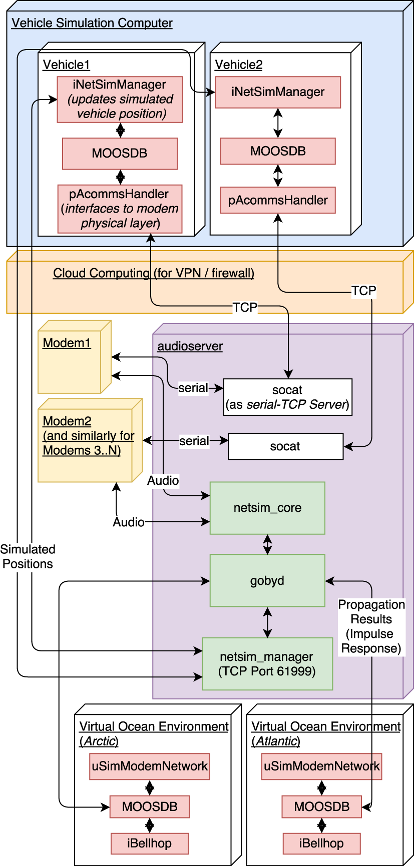

# Architecture

The overall architecture of a system using *netsim* is summarized in the figure below:

## Components

### Audioserver

The *audioserver* is at the heart of the system. Here is where the essential netsim processes are run:

 - [netsim_core](page11_netsim_core.md): Handles incoming audio data (via [JACK] from the sound card), detects acoustic modem packets, sends these packets for processing, and writes outgoing audio data back to JACK.
 - [netsim_manager](page12_netsim_manager.md): Handles simulated position data from the simulated vehicles or other nodes for use by the audio processing.
 - `gobyd`: Mediates interprocess publish/subscribe communications in the [Goby3] middleware.
 - `socat`: Provides a TCP server for the simulated vehicles to connect to each of the physical modem's serial or Ethernet interface.

[JACK]: https://jackaudio.org/
[Goby3]: https://github.com/GobySoft/goby3/

### Virtual Ocean Environments

`netsim_core` does not implement a specific processing framework for simulating the channel effects on the modem packets. This is handled via a plugin for a specific simulation system. Here, the MIT LAMSS Virtual Ocean Simulator is shown, based on MOOS.

 - `liblamss_netsim_processor_plugin.so` (not shown): Implements the convolution of the signal based on impulse response data received by the Virtual Ocean (uSimModemNetwork). This is run as a shared library plugin to `netsim_core`.
 - `iBellhop`: Provides a MOOS interface to the [Acoustics Toolbox]'s BELLHOP ray tracing propagation model.
 - `uSimModemNetwork`: Implements / interfaces to the rest of the Virtual Ocean. Computes impulse responses for the processor plugin.
 - `MOOSDB`: MOOS inter-process data broker.
 - `goby_moos_gateway` (not shown): Connects the `MOOSDB` to the `gobyd`.

While not necessary (except for the processor plugin to `netsim_core`), this code is run on the same physical *audioserver* on the GobySoft reference hardware setup.

[Acoustics Toolbox]: http://oalib.hlsresearch.com/AcousticsToolbox/

### Vehicle Simulation Computer(s)

The vehicle simulation can be run anywhere in the world, connected to the *audioserver* via an OpenVPN link through a cloud computing server (netsim.gobysoft.org).

Very little is required out of the vehicle simulation: it must provide basic position data for the simulated vehicles/nodes, and connect to the data interface of the modems via TCP.

In this diagram, the LAMSS MOOS-IvP vehicle simulator is show, with only the components that connect to *netsim* in some fashion.

 - pAcommsHandler: The MOOS interface to the [Goby][Goby3] acoustic networking libraries.
 - iNetSimManager: A MOOS implementation of the `netsim_manager` protocol for passing vehicle positions. For more detail, see the [Vehicle Simulator Connections](page15_vehicle_sim_connections.md) page.

## Goby3 Detailed Publish/Subscribe Interfaces

The *audioserver* core components are diagrammed in detail in the figure below. Note that the ProcessorThread shown is the *processor_echo* stub, thus not showing the publish/subscribe interfaces for the LAMSS Virtual Ocean processor plugin (which includes sending `impulse_response` and subscribing to `impulse_request`).

