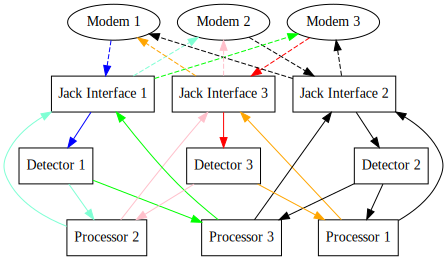

# netsim_core

The role of `netsim_core` is to oversee the audio processing from recording off the sound card through playing the modified data back to the receiver modems.

This is handled via a set of threads that communicate using the Goby3 interthread publish/subscribe mechanism, which passes shared pointers between threads. This provides for high throughput, low latency communications.

For detail on the specific publish/subscribe interfaces, see the [Architecture](page10_architecture.md) page.

## Configuration

Configuration is given as a Protobuf TextFormat file for the netsim::protobuf::NetSimCoreConfig message.

All available configuration values can be obtained by the `-e` flag to `netsim_core`.

For example,
```
NETSIM_PROCESSOR_LIBRARY=$HOME/netsim/build/lib/libnetsim_processor_echo_plugin.so \
$HOME/netsim/build/bin/netsim_core -e
```

yields

```
app { ... } # standard Goby3 app configuration
interprocess { ... } # standard Goby3 interprocess configuration (for connecting to gobyd)
number_of_modems:   # how many modems are connected
sampling_freq: 96000  # Hertz
node_name: ""  # name for mapping JACK index to string names used by netsim_manager. Must be one entry per modem, and the order listed corresponds to index 0, 1, 2, etc.
jack { ... } # see below
detector { ... } # see below
logger { ... } # see below
[netsim.processor_echo] { ... } # see below
```


## Threads

- JackThread (Jack Interface)
- DetectorThread (Detector)
- implementations of ProcessorThreadBase (Processor)

### JackThread

Indexed (using an integer template parameter) on the **transmitting** modem id (starting with 0), the JackThread receives data from that modem and publishes it (as frames of the same number of samples as the jackd server is configured with) to the netsim::groups::AudioIn, which is also indexed on the transmitting modem id ("from_index").

On the other side, it subscribes to all messages that originated from that same modem (from multiple ProcessorThreads), and writes them out to the correct outgoing JACK channel. This slightly counterintuitive way of handling outgoing data ensures that audio packets from multiple transmitting modems that arrive simulateneously are mixed by JACK) to capture the collisions that would happen in the real world in this case. This is perhaps more clearly illustrated below under the "Data flow example".

#### Configuration

Default configuration:
```
jack {
  capture_port_prefix: "system:capture_"
  playback_port_prefix: "system:playback_"
  port_name_starting_index: 1
  max_buffer_size: 100
  min_playback_buffer_size: 10
  calibration_seconds: 0
}
```

 - `capture_port_prefix`: String for JACK port for capturing transmitted data from the modems, which will be appended by the port index. Use `jack_lsp` to list your ports.
 - `playback_port_prefix`: String for JACK port for playing back audio to the modems.
 - `port_name_starting_index`: Starting value for the port index to be appended to `capture_port_prefix` and `playback_port_prefix`.
 - `max_buffer_size`: Maximum size of the buffer for captured data (before being published via Goby)
 - `min_playback_buffer_size`: Minimum size of the playback buffer, i.e. minimum number of frames required to have received from the ProcessorThreads before commencing playback. Increase this value to avoid buffer underruns, decreasing this value will decrease the minimum end-to-end latency of the system (useful for accurately simulating short range propagations).
 - `calibration_seconds`: Value to substract from playback start to compensate for the end-to-end latency of the netsim system. This is highly hardware and configuration dependent, so you will need to measure this for your own system to get accurate time-of-flights. The easiest way to do this is to use set your processor to return packets with zero artificial latency (buffer_start_time == captured buffer time) and measure the two way time of flight using the modem hardware ($CCMPC for the WHOI Micro-Modem).

### DetectorThread

Like the JackThread, each DetectorThread is indexed on the **transmitting** modem id ("from_index"), and subscribes to incoming data from the same JackThread. 

The detector is very simple; it is based on a threshold value detection. This should generally work fine since the audio coming off the sound card should be clean.

#### Configuration

```
detector {
  detection_threshold: 0.1
  packet_end_silent_seconds: 0.2
  packet_begin_prebuffer_seconds: 0.2
}
```

- detection_threshold: Absolute JACK float sample value to exceed to be considered a "detection".
- packet_end_silent_seconds: How many seconds without a sample above the `detection_threshold` to consider the packet to be over.
- packet_begin_prebuffer_seconds: How many seconds before the detection to include in the packet published to the processor threads.

### ProcessorThreadBase

The processor thread must be implemented for a specific propagation modeling framework by subclassing ProcessorThreadBase.

The ProcessorThreadBase is indexed on the **receiving** modem id ("to_index"), which is different than the DetectorThread and JackThread.

The ProcessorThreadBase subscribes to data from each DetectorThread, and when received, calls the virtual method 
`ProcessorThreadBase::detector_audio`. The processor thread implementation then processes this data (delay, convolution, etc.) and writes frames back by calling `ProcessorThreadBase::publish_audio_buffer`.

Additionally the virtual method `ProcessorThreadBase::update_buffer_size` is called whenever the `jackd` buffer size changes (which is at least once on startup).

A trivial example implementation that copies back all data it receives (without processing) is given in `netsim/src/test/processor_echo`. For the example, no configuration is used but a stub configuration message is defined:
```
[netsim.processor_echo] {
  example_cfg_value: 1 
}
```

A complete implementation for the LAMSS Virtual Ocean Simulator is provided at:

- <https://github.mit.edu/lamss/lamss/tree/master/src/lib/lib_netsim_processor>

### LoggerThread

The logger thread can write audio files (for all incoming and outgoing postprocessed packets) in binary format if desired.


#### Configuration

Should be self evident:
```
logger {
  run_logger: true
  log_directory: "."
}
```

## Data flow example

The figure belows shows the data flow for netsim-core showing three modems. Dashed lines represent analog audio; solid lines represent Goby3 digital audio frames. 

The colors represent two possible transmission paths:

 1. blue is a transmission from modem 1 which becomes teal and green receptions for modem 2 and 3, respectively. 
 1. red is a transmission from modem 3, which becomes orange and pink receptions for modem 1 and 2. 

Depending on temporal/spatial separation of the simulated modem locations and transmission times, collisions may occur and are modeled in netsim by audio mixing at modem 2.


