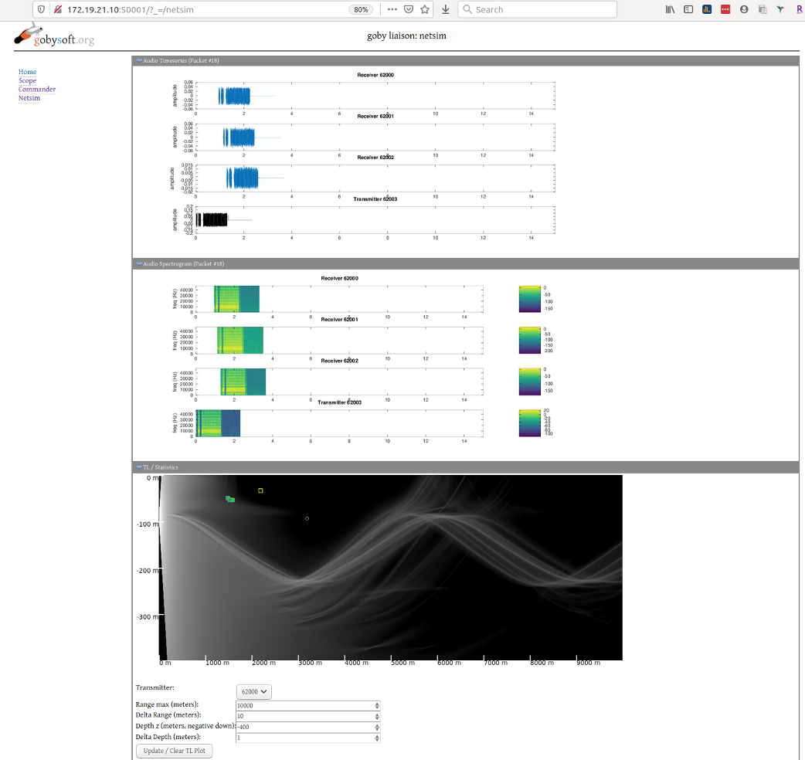

# Goby Liaison Viewer

*netsim* includes a plugin for the Goby Liaison webbrowser based user interface. This plugin provides a visual representation of the latest acoustic packet's transmission and reception, in both the time (timeseries) and frequency (spectrogram) domains.

An example of the output is:

## Audio Timeseries / Spectrogram

The timeseries and spectrogram for the latest transmission and receptions is shown based on the data captured by the logger thread of `netsim_core`. If logging is disabled, you will not see these figures.

Each figure is shown relative to the start of the packet as determined by the `netsim_core` detector thread, including the additional `packet_begin_prebuffer_seconds`, if any.

## TL / Statistics

In addition to the latest packet information, the TL / Statistics tab can show the modeled propagation loss (relative to the chosen "Transmitter") using the BELLHOP ray tracing tool. To enable, click the "Update / Clear TL Plot" button, and after several seconds the ray tracing figure will appear if everything is correctly configured. These figures are rendered using GNU Octave via the `netsim_postprocess` application.

To switch the visualization to use a different transmitter, change the "Transmitter" drop down selection and click the "Update / Clear TL Plot" again.

Each reception will be shown as an icon on the plot at the range and depth of the receiver. If your vehicle interface is configured to send receive statistics, these boxes will be colored by the quality of the reception.

For the WHOI Micro-Modem, the colors mean:

-  green to blue shading: low (-15 dB) to high (0 dB) equalizer mean squared error (MSE), but packet was successfully decoded.
-  red: bad packet (but packet was detected)
-  black: no packet detected

For all other modems, the only data currently supported is:

- green: packet sucess
- red: bad packet
- black: no packet detected
